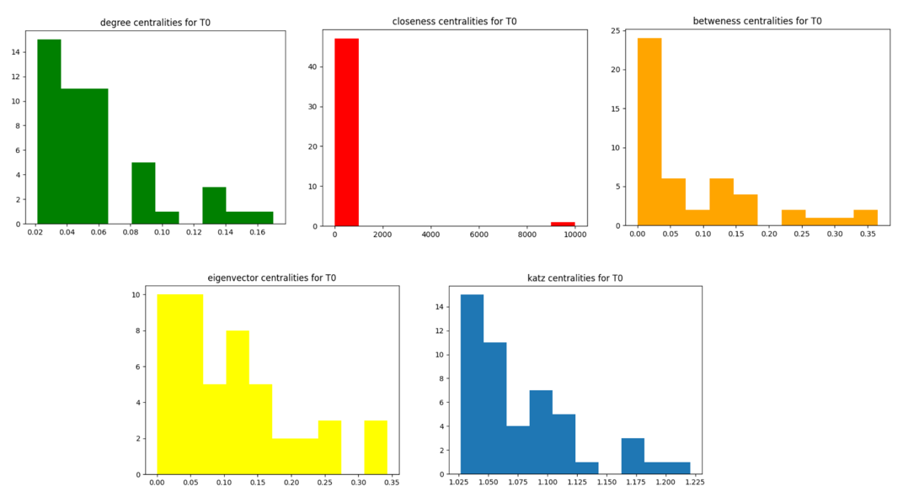

# 🌐Data Analysis on a Social Network
This project’s goal is to analyze a time-varying network.
> ℹ️ This project is not open source and does not grant any usage rights.
> For usage terms and legal information, see 🔒 [Code Ownership & Usage Terms](#-code-ownership--usage-terms).

## 🚀This project includes:
 - 🕰️Calculation of minimum and maximum time of time interval.
 - ⏳Calculation and partitioning of time interval into time sub-intervals.
 - 📽️Presentation of the subnetworks in each time sub-period through calculation of adjacency matrices.
 - 📊Calculation and graphical presentation of the distribution of centrality measures for each of the calculated subnetworks:
   - Degree Centrality
   - In-Degree Centrality
   - Out-Degree Centrality
   - Closeness Centrality
   - Betweenness Centrality
   - Eigenvector Centrality
   - Katz Centrality
 - 🧮 Calculation of $`Ε^*[t_{j-1},t_j]`$, $`V^*[t_{j-1},t_{j+1}]`$ and $`Ε^*[t_j,t_{j+1}]`$ sets for $`N=[1,N]`$, for every two temporally consecutive networks.
 - 🔢 Calculation of similarity matrices for each pair of nodes and each set from $`V^*`$ base on the edges of set $`Ε^*[t_{j-1},j]`$:
   - Graph Distance (Sgd)
   - Common Neighbors (Scn)
   - Jaccard’s Coefficient (Sjc)
   - Adamic / Adar (Sa)
   - Preferential Attachment (Spa)
 - ⚡Implementation of the Least Squares algorithm to solve the classification problem, given the previously calculated matrices.

## 🧠Technologies used:
 - Python
 - Numpy
 - Sklearn

## 🧰Prerequisites

Before running the application, make sure your environment is properly configured.
 - Python 3.9+ is recommended
 - Required Libraries
 - Numpy (version 2.0.0 or newer)
 - Sci-kit learn

## 🧪How to Run
1. Clone the repository (or download and decompress the ZIP file).
```bash
git clone https://github.com/theofanistzoumakas/social-network-analysis.git
cd social-network-analysis
```

2. Specify the path to your dataset (make sure that your data are tuples with three elements -> (source node, destination node, timestamp))
```bash
f = open(“your_source_file”) //line 25
```
and
```bash
f = open(“your_source_file”) //line 36
```

3. Confirm that you have installed the required libraries.
4. Run the project.
5. You will recommended to type a number N. This number will split the data into N datasets.
6. Then view for the first split dataset the minimum time, maximum time, time duration, the first five timestamps.
7. For the first time period see:
  - Adjacency matrix.
  - Graph representation of centralities:
    - Degree Centrality.
    - In-Degree Centrality.
    - Out-Degree Centrality.
    - Closeness Centrality.
    - Betweenness Centrality.
    - Eigenvector Centrality.
    - Katz Centrality.
   - See matrices $`Ε^*[t_{j-1},t_j]`$, $`V^*[t_{j-1},t_{j+1}]`$ and $`Ε^*[t_j,t_{j+1}]`$.
     - And for $`V^*`$ see:
        - Graph Distance (Sgd).
		- Common Neighbors (Scn).
        - Jaccard’s Coefficient (Sjc).
		- Adamic / Adar (Sa).
		- Preferential Attachment (Spa).
8. See the success rates, mean square error and absolute square error from using Least Squares algorithm.

## 📷 Screenshots

**_Indicative Screeenshot:_**  
> 


## 🎯Purpose
The purpose was to explore how useful information can be extracted from a social network, regarding the properties of users as well as the relationships between them over a specific period of time. **This application is developed solely for academic and research purposes**.


## 🔒 Code Ownership & Usage Terms
This project was created and maintained by:
 - Theofanis Tzoumakas (@theofanistzoumakas)
 - Konstantinos Pavlis (@kpavlis)
 - Michael-Panagiotis Kapetanios (@KapetaniosMP)

🚫 Unauthorized use is strictly prohibited.
No part of this codebase may be copied, reproduced, modified, distributed, or used in any form without explicit written permission from the owners.

Any attempt to use, republish, or incorporate this code into other projects—whether commercial or non-commercial—without prior consent may result in legal action.

For licensing inquiries or collaboration requests, please contact via email: theftzoumi _at_ gmail _dot_ com .

© 2025 Theofanis Tzoumakas, Konstantinos Pavlis, Michael-Panagiotis Kapetanios. All rights reserved.
